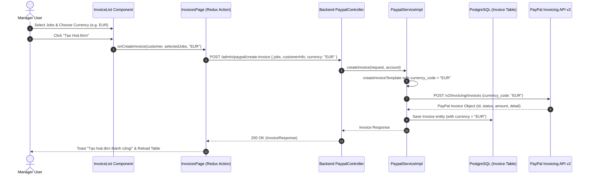

# feat: Add PayPal Currency Selection to Invoice Creation

## Summary

This plan adds support for selectable currency units when creating and dispatching PayPal invoices in the Linh Management System. A currency selection dropdown containing PayPal-supported ISO-4217 currencies (e.g., USD, EUR, AUD, CAD, GBP, JPY, SGD, etc., defaulting to `USD`) is added to the invoice creation interface. The selected currency is passed to the backend API (`/api/v1/admin/paypal/create-invoice`), persisted in a new `currency` column in the `Invoice` database table, and correctly mapped into the PayPal Invoicing API payload for invoice details and itemized pricing. All existing invoice creation, status tracking, webhook handling, and cancellation workflows remain intact.

---

## Problem Frame

Currently, when managers create a PayPal invoice for a customer via `PaypalServiceImpl.createInvoiceTemplate()`, the currency code is hardcoded to `"USD"` in both the invoice details (`detail.put("currency_code", "USD")`) and each item's unit amount (`"currency_code", "USD"`). Customers from various regions (e.g., Europe, Australia, UK, Asia) often request invoicing in their local currencies (EUR, AUD, GBP, SGD, etc.). Furthermore, the `Invoice` database entity lacks a dedicated `currency` column to store and query the currency in which the invoice was billed.

---

## Requirements

- **R1 (Frontend Currency Selector)**:
  - Add a currency dropdown selector in the invoice creation section of each customer card in `InvoiceList` (`job-management-app/src/components/invoices/invoice-list.tsx`).
  - Populate the dropdown with PayPal-supported currencies (with currency code and name/symbol, defaulting to `"USD"`).
  - Include the selected currency when triggering `onCreateInvoice(customer, selectedJobs, currency)`.

- **R2 (Frontend Types & API Integration)**:
  - Update `InvoiceRequest` interface in `types/invoices.tsx` to include `currency?: string`.
  - Update `InvoiceResponse` interface in `types/invoices.tsx` to include `currency?: string`.
  - Update `CreateInvoiceAction` payload dispatch in `app/dashboard/invoices/page.tsx` to pass the selected currency to the backend.

- **R3 (Backend DTO & Database Persistence)**:
  - Add `currency` field to `CreateInvoiceRequest.java` and `InvoiceResponse.java`.
  - Add `@Column(name = "currency", length = 10)` field in `Invoice.java` entity.
  - Provide a database migration script `src/main/resources/sql/add_currency_to_invoice.sql` (and support Hibernate `ddl-auto=update` schema update) with default `'USD'` for existing records.

- **R4 (PayPal Service Currency Dynamic Mapping)**:
  - Update `PaypalServiceImpl.createInvoiceTemplate()` to use the request's currency (normalized to uppercase, fallback to `"USD"` if null/blank) for `detail.currency_code` and all `items[].unit_amount.currency_code`.
  - In `PaypalServiceImpl.createInvoice()`, save `currency` in the `Invoice` entity.
  - In `PaypalServiceImpl.getListPageResponse()`, populate `currency` into `InvoiceResponse`.

- **R5 (Table Display & Formatting)**:
  - Update `invoices-table.tsx` to format invoice amounts using the invoice's saved currency code (e.g. `$`, `€`, `£`, `A$`) via an enhanced currency formatter rather than hardcoded USD formatting.

---

## Scope Boundaries

### In Scope
- Adding currency dropdown in `InvoiceList` UI per customer invoice creation action.
- Propagating selected currency from Frontend -> Backend DTO -> PayPal Invoicing REST API -> Database `Invoice.currency`.
- Returning and displaying the currency in `InvoicesTable`.
- Providing standard PayPal ISO currency dictionary.

### Out of Scope / Non-Goals
- Real-time exchange rate conversions or multi-currency conversions between jobs and invoices (job prices are passed as numerical values directly in the selected invoice currency).
- Modifying customer credit balance or wallet systems.
- Modifying webhook payment event payloads beyond verifying existing status transitions.

### Deferred to Follow-Up Work
- Custom currency symbol configuration per customer profile: Future enhancement.

---

## Context & Research

### Relevant Code and Patterns

- **Backend Entity**: `jobmanagement/src/main/java/org/com/jobmanagement/entity/Invoice.java`
- **Backend DTOs**:
  - `jobmanagement/src/main/java/org/com/jobmanagement/dto/request/CreateInvoiceRequest.java`
  - `jobmanagement/src/main/java/org/com/jobmanagement/dto/response/InvoiceResponse.java`
- **Backend Service**: `jobmanagement/src/main/java/org/com/jobmanagement/services/impl/PaypalServiceImpl.java` (lines 81–131 `createInvoiceTemplate`)
- **Backend Controller**: `jobmanagement/src/main/java/org/com/jobmanagement/controller/dashboard/PaypalController.java`
- **Frontend Pages & Components**:
  - `job-management-app/src/types/invoices.tsx`
  - `job-management-app/src/components/invoices/invoice-list.tsx`
  - `job-management-app/src/components/invoices/invoices-table.tsx`
  - `job-management-app/src/app/dashboard/invoices/page.tsx`
  - `job-management-app/src/lib/utils.ts` (`formatCurrency`)

### PayPal Supported Currencies Reference

PayPal Invoicing API v2 supports standard ISO-4217 currencies including:
- **USD**: US Dollar ($)
- **EUR**: Euro (€)
- **GBP**: British Pound (£)
- **AUD**: Australian Dollar (A$)
- **CAD**: Canadian Dollar (C$)
- **JPY**: Japanese Yen (¥)
- **SGD**: Singapore Dollar (S$)
- **HKD**: Hong Kong Dollar (HK$)
- **NZD**: New Zealand Dollar (NZ$)
- **CHF**: Swiss Franc (CHF)
- **SEK**: Swedish Krona (kr)
- **DKK**: Danish Krone (kr.)
- **NOK**: Norwegian Krone (kr)
- **PLN**: Polish Zloty (zł)
- **CZK**: Czech Koruna (Kč)
- **HUF**: Hungarian Forint (Ft)
- **ILS**: Israeli New Shekel (₪)
- **MXN**: Mexican Peso ($)
- **BRL**: Brazilian Real (R$)
- **MYR**: Malaysian Ringgit (RM)
- **PHP**: Philippine Peso (₱)
- **TWD**: New Taiwan Dollar (NT$)
- **THB**: Thai Baht (฿)
- **CNY**: Chinese Renminbi (¥)

---

## Key Technical Decisions

- **Decision 1: Fallback default to "USD"**:
  - If a legacy request or omitted currency parameter is received by the backend, default gracefully to `"USD"` to maintain 100% backward compatibility.
- **Decision 2: Currency state management in `InvoiceList`**:
  - Maintain a local state `selectedCurrencies: Record<number, string>` keyed by `customerId` (defaulting to `"USD"`). This allows managers to select different currencies for different customers concurrently without cross-contamination.
- **Decision 3: Dynamic Currency Formatting in Frontend**:
  - Update `formatCurrency(amount: number, currencyCode: string = "USD")` in `lib/utils.ts` using `Intl.NumberFormat("en-US", { style: "currency", currency: currencyCode })` to automatically format symbols correctly ($100.00, €100.00, £100.00, A$100.00, etc.).

---

## Open Questions

### Resolved During Planning
- *Q: Which currencies should be available in the dropdown?*
  - **Resolution**: Provide a dedicated list of standard PayPal currencies in `job-management-app/src/constants/currencies.ts`, sorted with popular currencies (USD, EUR, AUD, CAD, GBP, JPY, SGD) at the top.
- *Q: How should existing invoices in the database be handled?*
  - **Resolution**: Add database column `currency VARCHAR(10) DEFAULT 'USD'` and fallback to `"USD"` in DTO mapping if null.

### Deferred to Implementation
- None.

---

## High-Level Technical Design

> *This illustrates the intended approach and is directional guidance for review, not implementation specification. The implementing agent should treat it as context, not code to reproduce.*



---

## Implementation Units

### U1. Database Schema & Backend Entities / DTOs

**Goal:** Add `currency` column to `Invoice` entity, update `CreateInvoiceRequest` and `InvoiceResponse`, and provide SQL migration script.

**Requirements:** R3

**Dependencies:** None

**Files:**
- Create: `jobmanagement/src/main/resources/sql/add_currency_to_invoice.sql`
- Modify: `jobmanagement/src/main/java/org/com/jobmanagement/entity/Invoice.java`
- Modify: `jobmanagement/src/main/java/org/com/jobmanagement/dto/request/CreateInvoiceRequest.java`
- Modify: `jobmanagement/src/main/java/org/com/jobmanagement/dto/response/InvoiceResponse.java`

**Approach:**
- In `Invoice.java`, add `@Column(name = "currency", length = 10) private String currency;`.
- In `CreateInvoiceRequest.java`, add `private String currency;`.
- In `InvoiceResponse.java`, add `private String currency;`.
- In `add_currency_to_invoice.sql`, add `ALTER TABLE "Invoice" ADD COLUMN IF NOT EXISTS currency VARCHAR(10) DEFAULT 'USD';`.

**Patterns to follow:**
- `jobmanagement/src/main/java/org/com/jobmanagement/entity/Invoice.java`
- `jobmanagement/src/main/resources/sql/payment-status-migration.sql`

**Test scenarios:**
- **Happy path**: Build project and verify `Invoice` entity compiles with `currency` getter/setter and builder support.
- **Integration**: Hibernate boot automatically applies column update or migration runs cleanly without breaking existing invoice queries.

**Verification:**
- `mvn compile` in `jobmanagement` completes without errors.

---

### U2. Backend Service Logic for PayPal Invoice Template

**Goal:** Pass the selected currency to PayPal Invoicing API and persist `currency` on the `Invoice` entity and response DTO.

**Requirements:** R3, R4

**Dependencies:** U1

**Files:**
- Modify: `jobmanagement/src/main/java/org/com/jobmanagement/services/impl/PaypalServiceImpl.java`

**Approach:**
- In `createInvoiceTemplate(CreateInvoiceRequest request)`:
  - Extract `String currency = (request.getCurrency() != null && !request.getCurrency().trim().isEmpty()) ? request.getCurrency().trim().toUpperCase() : "USD";`
  - In `detail` map: `detail.put("currency_code", currency);`
  - In `items` mapping: replace hardcoded `"USD"` with `currency` in `unit_amount.currency_code`.
- In `createInvoice(CreateInvoiceRequest request, Account account)`:
  - Set `.currency(currency)` when building `Invoice invoiceEntity`.
- In `getListPageResponse(Page<Invoice> invoicePages)`:
  - Set `.currency(invoice.getCurrency() != null ? invoice.getCurrency() : "USD")` on `InvoiceResponse`.

**Patterns to follow:**
- `jobmanagement/src/main/java/org/com/jobmanagement/services/impl/PaypalServiceImpl.java` (lines 81–131)

**Test scenarios:**
- **Happy path**: When `currency="EUR"` is sent in `CreateInvoiceRequest`, the PayPal payload contains `"currency_code": "EUR"` in `detail` and all `items`.
- **Edge case (Null/Empty Currency)**: When `currency=null` or `""`, the system defaults to `"USD"`.
- **Integration**: Created `Invoice` entity is saved with `currency="EUR"`, and `listInvoices` / `searchInvoiceByConditions` returns `currency="EUR"` in `InvoiceResponse`.

**Verification:**
- Unit/integration test or compile verification passes with updated `PaypalServiceImpl`.

---

### U3. Frontend Currency Constants & Utility Formatter

**Goal:** Create PayPal supported currencies constant list and enhance `formatCurrency` to support dynamic currency codes.

**Requirements:** R1, R5

**Dependencies:** None

**Files:**
- Create: `job-management-app/src/constants/currencies.ts`
- Modify: `job-management-app/src/lib/utils.ts`

**Approach:**
- Create `job-management-app/src/constants/currencies.ts` exporting `PAYPAL_CURRENCIES` array:
  ```typescript
  export interface CurrencyOption {
    code: string;
    label: string;
    symbol: string;
  }

  export const PAYPAL_CURRENCIES: CurrencyOption[] = [
    { code: "USD", label: "USD - US Dollar ($)", symbol: "$" },
    { code: "EUR", label: "EUR - Euro (€)", symbol: "€" },
    { code: "AUD", label: "AUD - Australian Dollar (A$)", symbol: "A$" },
    { code: "CAD", label: "CAD - Canadian Dollar (C$)", symbol: "C$" },
    { code: "GBP", label: "GBP - British Pound (£)", symbol: "£" },
    { code: "JPY", label: "JPY - Japanese Yen (¥)", symbol: "¥" },
    { code: "SGD", label: "SGD - Singapore Dollar (S$)", symbol: "S$" },
    { code: "HKD", label: "HKD - Hong Kong Dollar (HK$)", symbol: "HK$" },
    { code: "NZD", label: "NZD - New Zealand Dollar (NZ$)", symbol: "NZ$" },
    { code: "CHF", label: "CHF - Swiss Franc (CHF)", symbol: "CHF" },
    { code: "SEK", label: "SEK - Swedish Krona (kr)", symbol: "kr" },
    { code: "DKK", label: "DKK - Danish Krone (kr.)", symbol: "kr." },
    { code: "NOK", label: "NOK - Norwegian Krone (kr)", symbol: "kr" },
    { code: "PLN", label: "PLN - Polish Zloty (zł)", symbol: "zł" },
    { code: "CZK", label: "CZK - Czech Koruna (Kč)", symbol: "Kč" },
    { code: "HUF", label: "HUF - Hungarian Forint (Ft)", symbol: "Ft" },
    { code: "ILS", label: "ILS - Israeli New Shekel (₪)", symbol: "₪" },
    { code: "MXN", label: "MXN - Mexican Peso ($)", symbol: "$" },
    { code: "BRL", label: "BRL - Brazilian Real (R$)", symbol: "R$" },
    { code: "MYR", label: "MYR - Malaysian Ringgit (RM)", symbol: "RM" },
    { code: "PHP", label: "PHP - Philippine Peso (₱)", symbol: "₱" },
    { code: "TWD", label: "TWD - New Taiwan Dollar (NT$)", symbol: "NT$" },
    { code: "THB", label: "THB - Thai Baht (฿)", symbol: "฿" },
    { code: "CNY", label: "CNY - Chinese Renminbi (¥)", symbol: "¥" },
  ];
  ```
- In `lib/utils.ts`:
  - Update `formatCurrency(amount: number, currencyCode: string = "USD"): string` to format amounts with the given `currencyCode` via `Intl.NumberFormat`.

**Patterns to follow:**
- `job-management-app/src/lib/utils.ts`

**Test scenarios:**
- **Happy path**: `formatCurrency(100, "EUR")` formats to `€100.00` (or appropriate locale string), `formatCurrency(100, "USD")` formats to `$100.00`.
- **Edge case**: `formatCurrency(100, "")` or `formatCurrency(100, undefined)` falls back safely to `"USD"`.

**Verification:**
- Formatter returns expected currency symbol and number formatting.

---

### U4. Frontend Type Definitions & Redux / Page Handlers

**Goal:** Update TypeScript interfaces and page handler to accept and dispatch `currency`.

**Requirements:** R2

**Dependencies:** U3

**Files:**
- Modify: `job-management-app/src/types/invoices.tsx`
- Modify: `job-management-app/src/app/dashboard/invoices/page.tsx`

**Approach:**
- In `types/invoices.tsx`:
  - Add `currency?: string;` to `InvoiceRequest`.
  - Add `currency?: string;` to `InvoiceResponse`.
- In `app/dashboard/invoices/page.tsx`:
  - Update `handleCreateInvoice(customer: CustomerInfo, selectedJobs: JobResponse[], currency: string = "USD")`:
    - Pass `currency` in the `payload` to `CreateInvoiceAction({ customerInfo: customer, jobs: selectedJobs, currency })`.

**Patterns to follow:**
- `job-management-app/src/store/slice/invoices/Invoices.tsx`
- `job-management-app/src/app/dashboard/invoices/page.tsx`

**Test scenarios:**
- **Happy path**: Calling `handleCreateInvoice` with currency `"EUR"` dispatches payload containing `{ customerInfo, jobs, currency: "EUR" }`.
- **TypeScript compile check**: `npm run build` succeeds without type errors.

**Verification:**
- TypeScript compiler passes with updated interfaces.

---

### U5. Frontend Invoice Creation UI Dropdown & Invoices Table Display

**Goal:** Add currency dropdown selector in `InvoiceList` customer cards and display dynamic currency in `InvoicesTable`.

**Requirements:** R1, R5

**Dependencies:** U3, U4

**Files:**
- Modify: `job-management-app/src/components/invoices/invoice-list.tsx`
- Modify: `job-management-app/src/components/invoices/invoices-table.tsx`

**Approach:**
- In `invoice-list.tsx`:
  - Import `PAYPAL_CURRENCIES` from `@/constants/currencies`.
  - Add state `selectedCurrencies: Record<number, string>` (defaulting to `"USD"` for each customer).
  - In the footer bar of each customer accordion (next to "Tạo Hoá Đơn"), render a currency selector:
    ```tsx
    <div className="border-t p-4 flex items-center justify-end gap-3">
      <div className="flex items-center gap-2">
        <span className="text-sm text-muted-foreground font-medium">Đơn vị tiền tệ:</span>
        <Select
          value={selectedCurrencies[customer.customer.id] || "USD"}
          onValueChange={(val) =>
            setSelectedCurrencies((prev) => ({ ...prev, [customer.customer.id]: val }))
          }
        >
          <SelectTrigger className="w-[140px] h-9">
            <SelectValue />
          </SelectTrigger>
          <SelectContent className="max-h-[250px]">
            {PAYPAL_CURRENCIES.map((c) => (
              <SelectItem key={c.code} value={c.code}>
                {c.code} ({c.symbol})
              </SelectItem>
            ))}
          </SelectContent>
        </Select>
      </div>
      <Button
        onClick={() => {
          const selectedJobIds = getSelectedJobsByCustomer(customer.customer.id);
          const chosenCurrency = selectedCurrencies[customer.customer.id] || "USD";
          if (selectedJobIds.length > 0) {
            onCreateInvoice(
              customer.customer,
              customer.jobs.filter((job) => selectedJobIds.includes(job.id)),
              chosenCurrency
            );
          }
        }}
        disabled={getSelectedJobsByCustomer(customer.customer.id).length === 0 || loading}
      >
        Tạo Hoá Đơn ({getSelectedJobsByCustomer(customer.customer.id).length})
      </Button>
    </div>
    ```
  - Update `InvoiceListProps` callback: `onCreateInvoice: (customer: CustomerInfo, selectedJob: JobResponse[], currency: string) => void`.
- In `invoices-table.tsx`:
  - In the "Tổng Tiền" column cell, format the amount using `formatCurrency(invoice.dueAmount?.value || 0, invoice.currency || invoice.dueAmount?.currency_code || "USD")`.

**Patterns to follow:**
- `job-management-app/src/components/invoices/invoice-list.tsx`
- `job-management-app/src/components/ui/select.tsx`

**Test scenarios:**
- **Happy path**: Manager expands customer card, selects jobs, changes currency to "EUR", clicks "Tạo Hoá Đơn", invoice is created in EUR.
- **Display check**: Invoices created in EUR show `€` amounts in `InvoicesTable`.
- **Default state**: When opening a customer card, currency is pre-selected as "USD".

**Verification:**
- Run `npm run build` in `job-management-app` to verify clean build.
- Manual test in UI verifies dropdown renders with all PayPal currencies and dispatches correct currency code.

---

## System-Wide Impact

- **Interaction graph:**
  - `InvoiceList` (UI) -> `InvoicesPage.handleCreateInvoice` -> `CreateInvoiceAction` (Redux) -> `InvoiceApi.createInvoice` (Axios) -> `PaypalController.createInvoice` (Spring Boot) -> `PaypalServiceImpl.createInvoiceTemplate` -> `PaypalClient.createInvoice` (PayPal REST API) -> `InvoiceRepository.save` (PostgreSQL).
- **Error propagation:**
  - If an invalid currency code is supplied, PayPal API returns a 400 Bad Request error which is caught and surfaced via `ApiException` -> Redux rejected -> Toast error in UI.
- **Unchanged invariants:**
  - Invoice IDs generation, send invoice, cancel invoice, and webhook payment callbacks (`INVOICING.INVOICE.PAID`, `INVOICING.INVOICE.CANCELLED`) remain completely unchanged and function identically regardless of currency.

---

## Risks & Dependencies

| Risk | Mitigation |
|------|------------|
| Unsupported currency code sent to PayPal | Use a curated static enum/list of verified PayPal supported currencies (`PAYPAL_CURRENCIES`). |
| Existing invoices in DB have `currency = null` | Set default column value `'USD'` and fallback to `"USD"` in DTO mapping and UI table rendering. |
| User creates invoices for multiple customers with different currencies | State is keyed per `customerId` (`selectedCurrencies[customerId]`), ensuring no cross-customer state contamination. |

---

## Documentation / Operational Notes

- When deploying backend changes, ensure the database update runs (`ALTER TABLE "Invoice" ADD COLUMN IF NOT EXISTS currency VARCHAR(10) DEFAULT 'USD';`).
- Ensure no change to `.env` or PayPal credentials is required.

---

## Sources & References

- Backend service: [PaypalServiceImpl.java](file:///Users/pro/Documents/working/linh_management_system/jobmanagement/src/main/java/org/com/jobmanagement/services/impl/PaypalServiceImpl.java)
- Backend entity: [Invoice.java](file:///Users/pro/Documents/working/linh_management_system/jobmanagement/src/main/java/org/com/jobmanagement/entity/Invoice.java)
- Frontend invoice list: [invoice-list.tsx](file:///Users/pro/Documents/working/linh_management_system/job-management-app/src/components/invoices/invoice-list.tsx)
- Frontend invoices table: [invoices-table.tsx](file:///Users/pro/Documents/working/linh_management_system/job-management-app/src/components/invoices/invoices-table.tsx)
